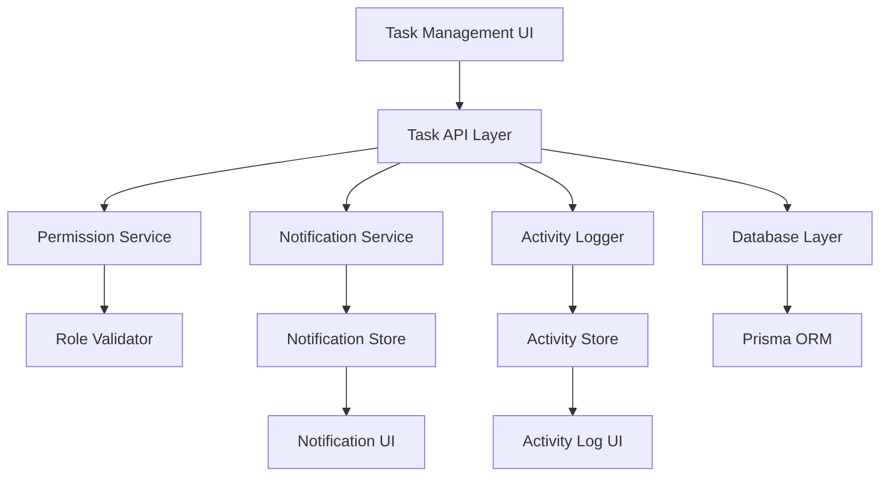

# Task Management Enhancement Design

## Overview

This design document outlines the architecture and implementation approach for enhancing the existing CollabHub task management system with role-based permissions, notifications, activity logging, and controlled status progression. The solution builds upon the existing Prisma schema and React components while adding new notification and activity tracking capabilities.

## Architecture

### System Components



### Data Flow

1. **Task Operations** → Permission Check → Database Update → Activity Log → Notification (if applicable)
2. **Status Changes** → Assignee Validation → Progression Validation → Update → Log Activity
3. **Notifications** → Real-time Updates → UI Display → User Acknowledgment

## Components and Interfaces

### 1. Enhanced Task API Routes

**File: `/api/workspaces/[slug]/tasks/[taskId]/route.ts`**
- Add permission validation for status updates and deletions
- Implement forward-only status progression logic
- Integrate activity logging for all operations

**File: `/api/workspaces/[slug]/tasks/route.ts`**
- Add notification creation on task assignment
- Enhance task creation with activity logging

### 2. Notification System

**File: `/api/workspaces/[slug]/notifications/route.ts`**
- GET: Fetch user notifications
- PATCH: Mark notifications as read
- DELETE: Remove notifications

**Component: `NotificationBell.tsx`**
- Display notification count in navbar
- Show notification dropdown with task assignments
- Handle notification acknowledgment

### 3. Activity Logging System

**Component: `TaskActivityLog.tsx`**
- Display chronological task activities
- Show user attribution and timestamps
- Filter activities by task or user

**Service: `ActivityLogger.ts`**
- Centralized logging for all task operations
- Standardized activity message formatting
- Database persistence through Prisma

### 4. Enhanced Task Components

**Component: `TaskCard.tsx`**
- Display creator and assignee information
- Show status change buttons based on permissions
- Implement forward-only status progression UI

**Component: `TaskStatusControls.tsx`**
- Render appropriate status buttons for current user
- Validate status transitions client-side
- Handle status change API calls

## Data Models

### New Database Tables

```sql
-- Notifications table
model Notification {
  id          String   @id @default(cuid())
  type        NotificationType
  title       String
  message     String
  isRead      Boolean  @default(false)
  createdAt   DateTime @default(now())
  
  // Relationships
  userId      String
  user        User @relation(fields: [userId], references: [id], onDelete: Cascade)
  
  taskId      String?
  task        Task? @relation(fields: [taskId], references: [id], onDelete: Cascade)
  
  workspaceId String
  workspace   Workspace @relation(fields: [workspaceId], references: [id], onDelete: Cascade)
}

-- Task activities table
model TaskActivity {
  id          String   @id @default(cuid())
  action      TaskAction
  description String
  createdAt   DateTime @default(now())
  
  // Relationships
  taskId      String
  task        Task @relation(fields: [taskId], references: [id], onDelete: Cascade)
  
  performedById String
  performedBy   User @relation(fields: [performedById], references: [id])
  
  workspaceId String
  workspace   Workspace @relation(fields: [workspaceId], references: [id], onDelete: Cascade)
}

-- Enums
enum NotificationType {
  TASK_ASSIGNED
  TASK_STATUS_CHANGED
  TASK_COMPLETED
}

enum TaskAction {
  CREATED
  ASSIGNED
  STATUS_CHANGED
  DELETED
  UNASSIGNED
}
```

### Enhanced Task Model
- Add relationships to notifications and activities
- Maintain existing structure for backward compatibility

## Error Handling

### Permission Errors
- **401 Unauthorized**: User not authenticated
- **403 Forbidden**: User lacks permission for operation
- **400 Bad Request**: Invalid status transition attempted

### Validation Errors
- Status progression validation on both client and server
- Task assignment validation (user must be workspace member)
- Notification creation validation

### Error Response Format
```typescript
interface ErrorResponse {
  error: string
  code: string
  details?: any
}
```

## Testing Strategy

### Unit Tests
- Permission validation logic
- Status progression validation
- Activity logging functions
- Notification creation logic

### Integration Tests
- Task API endpoints with permission checks
- Notification system end-to-end
- Activity logging across operations

### Component Tests
- TaskCard permission-based rendering
- NotificationBell functionality
- TaskStatusControls behavior

### User Acceptance Tests
- Task assignment notification flow
- Status progression restrictions
- Activity log accuracy
- Permission enforcement

## Security Considerations

### Authentication & Authorization
- Verify user session for all operations
- Validate workspace membership
- Enforce role-based permissions

### Data Validation
- Server-side validation for all inputs
- Status transition validation
- User permission checks

### Audit Trail
- Complete activity logging for compliance
- User attribution for all actions
- Timestamp accuracy for audit purposes

## Performance Considerations

### Database Optimization
- Index on frequently queried fields (userId, taskId, workspaceId)
- Efficient notification queries with pagination
- Activity log cleanup for old entries

### Real-time Updates
- Consider WebSocket implementation for live notifications
- Optimistic UI updates for better user experience
- Efficient state management for notification counts

### Caching Strategy
- Cache user permissions for session duration
- Cache notification counts
- Invalidate caches on relevant data changes